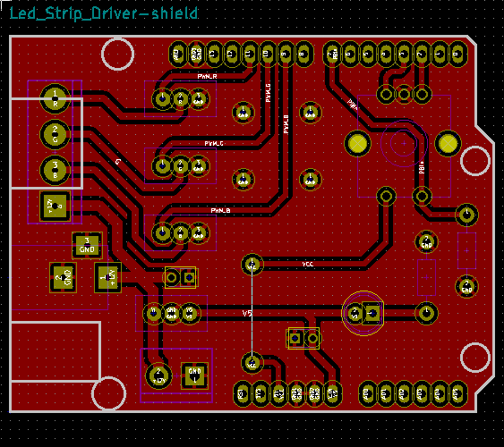
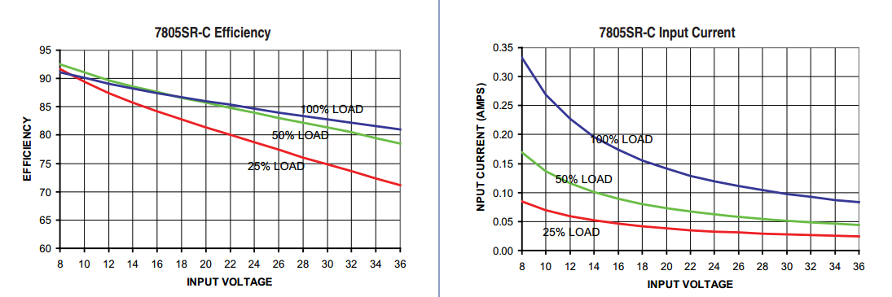

# Light-Table

Light Table design files & Firmware

##Arduino shield

###Regulated version

Arduino shield drives from 12V DC Jack (Center positive) and power Arduino through a voltage regulator (LM7805/Murata 7805SRH-C) with decoupling caps. Works with pwm to control Mosfets (IRF3205) (Up to 1.2A/Mosfet).

**If using Murata 7805SRH-C do not use decoupling caps, there is no need for it.**

### Non regulated version

Power the whole thing with 12V connected on the DC Jack of the shield (**Do not connect other jack on the board**). If your board is a cheap clone or you are not sure that it got a good regulator or protection, use regulated version.

##Arduino Firmware

Support single or long click: Single click put FW in color selection mode and long click clears the leds.
Control color over Bluetooth and Android/Protocoder App.

##Android Apps
###Protocoder

Protocoder app is used to control color on the light table over Bluetooth. You can download both code and project from Android apps folder.

###App Inventor

App Inventor app is used to control color on the light table over Bluetooth. You can download both code and project from Android apps folder.

##Hardware Used

<table>
  <tr>
    <th class="tg-031e">Reference</th>
    <th class="tg-031e">Value</th>
  </tr>
  <tr>
    <td class="tg-031e">C1</td>
    <td class="tg-031e">100uF</td>
  </tr>
  <tr>
    <td class="tg-031e">C2</td>
    <td class="tg-031e">10uF</td>
  </tr>
  <tr>
    <td class="tg-031e">CON1</td>
    <td class="tg-031e">BARREL_JACK</td>
  </tr>
  <tr>
    <td class="tg-031e">D1</td>
    <td class="tg-031e">PWR</td>
  </tr>
  <tr>
    <td class="tg-031e">EN1</td>
    <td class="tg-031e">ENCODER_5_PINS</td>
  </tr>
  <tr>
    <td class="tg-031e">P1</td>
    <td class="tg-031e">Screw Block 2</td>
  </tr>
  <tr>
    <td class="tg-031e">P8</td>
    <td class="tg-031e">Screw Block 4</td>
  </tr>
  <tr>
    <td class="tg-031e">R1</td>
    <td class="tg-031e">10K</td>
  </tr>
  <tr>
    <td class="tg-031e">R2</td>
    <td class="tg-031e">330</td>
  </tr>
  <tr>
    <td class="tg-031e">SHIELD1</td>
    <td class="tg-031e">ARDUINO_SHIELD</td>
  </tr>
  <tr>
    <td class="tg-031e">U1</td>
    <td class="tg-031e">IRF3205</td>
  </tr>
  <tr>
    <td class="tg-031e">U2</td>
    <td class="tg-031e">IRF3205</td>
  </tr>
  <tr>
    <td class="tg-031e">U3</td>
    <td class="tg-031e">IRF3205</td>
  </tr>
  <tr>
    <td class="tg-031e">U4</td>
    <td class="tg-031e">LM7805</td>
  </tr>
</table>

##Issues

### 1: Inefficient power regulation (n = 0.41667).

Generates so much heat. Solutions:

1. Change Lm7805 module to 78XXSR Murata switching regulator.
2. Add a Heatsink (Still to much heat) and a fan.

By using a efficient power regulation will not need to use heat sink and/or fan.

Will change LM7805 module to a 7805SRH-C module. efficiency graph:

As it will have 12V as input voltage will get from 87 to 90% efficiency.
